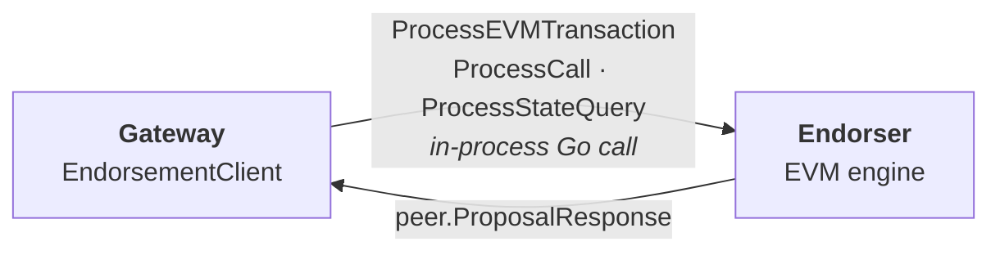
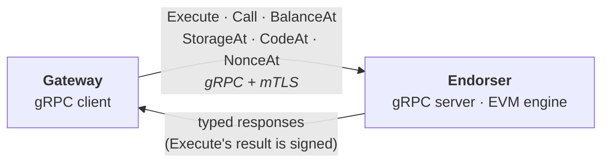

# Endorsement API Design - Overview

> This is part 0 of a multi-part design for a custom gRPC endorsement API
> exposed by the fabric-x-evm gateway's endorser component. It frames the
> problem, scope, and process. Later parts cover the proto/API, errors and
> security, the client/config/testing, and the implementation plan.

## Table of Contents

- [Motivation](#motivation)
- [Goals](#goals)
- [Non-Goals](#non-goals)
- [Related Issues](#related-issues)
- [Current Architecture](#current-architecture)
- [Target Architecture](#target-architecture)
- [Document Series](#document-series)
- [Time Plan](#time-plan)
- [Risks](#risks)
- [Glossary](#glossary)

## Motivation

Today the gateway invokes the endorser through **in-process Go function
calls**. The gateway constructs an `EndorsementClient` that holds a slice of
`Endorser` interface values and calls them directly (see
[`gateway/core/endorse.go`](../../../gateway/core/endorse.go)). This works for
an embedded, single-binary deployment but does not support running the gateway
and endorser as separate processes or on separate hosts.

The goal is a **custom gRPC API, specialized for fabric-x-evm**, exposed by
each gateway's endorser component. It replaces the in-process calls with a
network boundary while preserving the exact semantics the gateway relies on
today. It is intentionally *not* a generic endorsement API - it is a clean,
typed contract tailored to the functions fabric-x-evm actually needs, without
the generic Fabric proposal format on the wire.

The `Endorser` interface already anticipates this: its doc comment names
"local, gRPC client, mock" as intended implementations, so the gRPC client is a
drop-in behind the existing seam.

## Goals

- Expose a gRPC endorsement API from the endorser component that supports
  everything the gateway does today:
  - **Transactions** - endorse an executed Ethereum transaction.
  - **Calls** - execute a read-only `eth_call`.
  - **State queries** - read balance, code, storage, and nonce.
- Keep the proto schema **easy to understand, future-proof, and aligned with
  fabric-x-common naming** where possible.
- Preserve the current **error semantics** (reverts vs. execution errors vs.
  server errors) across the network boundary.
- Support **mTLS** and define the other security and resilience properties the
  boundary needs.
- Reuse known-working, efficient code from fabric-x-committer where it makes
  sense; document where we duplicate vs. depend vs. upstream to
  fabric-x-common.
- Land the change as a series of **small, low-disruption PRs** behind the
  existing `Endorser` interface.

## Non-Goals

- Replacing the Ethereum JSON-RPC surface the gateway exposes to clients - that
  stays unchanged.
- A generic, multi-application endorsement protocol - this API is specific to
  fabric-x-evm.
- Changing endorsement policy, MVCC validation, or the commit path.
- Dependency-aware scheduling and mempool retry (tracked separately in #50 and
  #59); the API must not preclude them, but they are out of scope here.

## Related Issues

- **Implements:** #22 (Implement gRPC Communication) - this design series is its
  design phase.

## Current Architecture

- The gateway's `EndorsementClient` fans out to one or more `Endorser`
  instances and collects signed `peer.ProposalResponse` values.
- The contract is the three-method `Endorser` interface in
  [`gateway/core/endorse.go`](../../../gateway/core/endorse.go).
- Responses are already Fabric `peer.ProposalResponse` messages, and
  transaction endorsement already flows through Fabric proposal machinery
  (`endorsement.Invocation`, `protoutil`).

## Target Architecture

- One RPC per engine function, fully typed - no dispatch enums and no generic
  proposal wrapper on the wire.
- `Execute` is the only RPC that produces an endorsement: its response carries
  the execution result (read-write set, event, status) plus the endorser's
  signature. The read-only RPCs return plain typed values.
- The gateway keeps assembling the Fabric transaction envelope; the wire moves
  only what the endorser needs (the marshaled Ethereum transaction, call args,
  state-read parameters) and what it produces.

## Document Series

| Part | File | Scope |
|------|------|-------|
| 0 | `00-overview.md` (this doc) | Problem framing, scope, process, time plan, risks |
| 1 | `01-api-and-proto.md` | Proto schema, RPC shape, serialization, streaming, committer alignment |
| 2 | `02-errors-and-security.md` | Error taxonomy, mTLS, security, resilience |
| 3 | `03-client-config-testing.md` | Endorsement client, configuration, testing |
| 4 | `04-implementation-plan.md` | Small-PR rollout sequence |

Design choices and their reasoning are stated inline where each choice is made.

## Time Plan

Rough, structure-only sequencing - no hard deadlines. Design parts are
sequential PRs; implementation follows once the design is agreed.

| Phase | Work | Rough effort |
|-------|------|--------------|
| D1 | Overview + agreement on scope (this PR) | ~few days |
| D2 | Proto/API design (part 1) | ~1 week |
| D3 | Errors + security (part 2) | ~few days |
| D4 | Client, config, testing (part 3) | ~few days |
| D5 | Implementation plan (part 4) | ~few days |
| I1+ | Implementation in small PRs | per plan in part 4 |

## Risks

- **Interface drift:** the boundary must exactly preserve current semantics
  (status codes, revert handling); a mismatch would surface as subtle receipt
  or error regressions.
- **Serialization fidelity:** signed payloads (the Ethereum transaction and the
  execution result) must round-trip byte-exact so signatures stay valid.
- **Code-reuse decision:** duplicating fabric-x-committer code risks drift;
  depending on it risks coupling. The choice affects long-term maintenance.
- **Security surface:** exposing endorsement over the network adds an
  authenticated, authorized entry point that did not exist in-process.

## Glossary

- **Gateway** - component exposing the Ethereum JSON-RPC API and driving
  endorsement, ordering, and commit.
- **Endorser** - component that executes EVM transactions/calls against its
  state and produces signed proposal responses.
- **ExecutionResult** - the outcome of executing a transaction: read-write
  set, optional event, and a status/message/payload triple.
- **Endorsement** - the endorser's signature over an execution result, which
  the gateway maps into the Fabric transaction envelope.
- **Revert** - an EVM execution that reverts; still endorsed and submitted so
  the receipt records `status=0`, carried inside the execution result.
